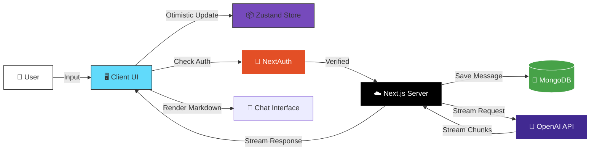
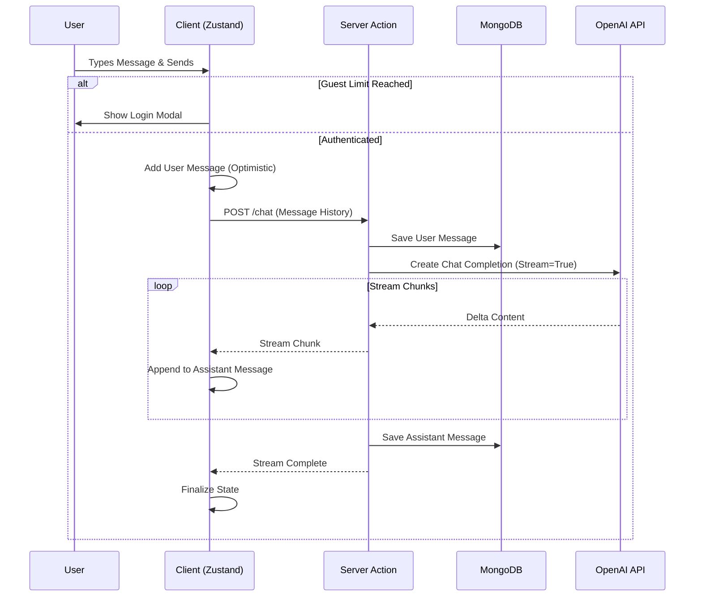

# Ai Buddy Chat

<div align="center">


<a href="https://nextjs.org">
  
</a>
<a href="https://react.dev">
  
</a>
<a href="https://www.typescriptlang.org">
  
</a>
<a href="https://tailwindcss.com">
  
</a>
<a href="https://openai.com">
  
</a>
<a href="https://www.mongodb.com">
  
</a>
<a href="https://authjs.dev">
  
</a>

</div>

---

# 🔮 Overview

**Ai Buddy Chat** isn't just another chatbot—it's a **premium, architectural masterpiece** designed for developers who demand excellence. Built on the bleeding edge of web technology, it orchestrates a symphony of **Real-time AI**, **Fluid Animations**, and **Type-Safe Architecture**.

Now featuring a **ChatGPT-like experience** with Guest Mode access limits, secure Google Authentication, and persistent cloud storage for all your conversations.

## ✨ Why Ai Buddy?

-   **⚡ Zero-Latency Feel**: Powered by optimistic UI updates and efficient streaming.
-   **🎨 Cinematic Visuals**: Deep integration of **Framer Motion** for layout transitions and **Lenis** for buttery smooth scrolling.
-   **🔐 Secure & Personal**: **Google OAuth** integration ensures your chats are private and persistent.
-   **🧠 Smart Memory**: Conversations are stored in **MongoDB**, allowing you to pick up exactly where you left off across devices.
-   **🆓 Guest Mode**: Try before you sign in. Guests get a 1-message preview before being prompted to unlock full access.

---

# 🏛️ System Architecture

We adhere to a clean, separation-of-concerns architecture where the UI assumes a reactive state driven by Zustand, whilst standard Next.js Server Actions handle the heavy lifting of API streaming and Database interaction.

## High-Level Data Flow



## Detailed Interaction Sequence



---

# 📂 Project Structure

A meticulously organized codebase ensuring scalability and maintainability.

```bash
d:/Projects/Ai Buddy/
├── 📁 app/                    # 🚀 Next.js App Router System
│   ├── 📁 api/                #    Server-side API routes & Edge Functions
│   │   ├── 📁 auth/           #    NextAuth Handler
│   │   └── 📁 chat-v2/        #    Chat Stream Handler
│   ├── layout.tsx             #    Root Layout (Providers Injection)
│   └── globals.css            #    Tailwind V4 Directives & Theme Variables
├── 📁 components/             # 🧩 UI Building Blocks
│   ├── 📁 ui/                 #    Shadcn/Radix atomic components
│   ├── chat-interface.tsx     #    Main Chat Orchestrator
│   ├── LoginModal.tsx         #    Auth Entry Point
│   └── ChatSidebar.tsx        #    History Navigation
├── 📁 lib/                    # 🛠️ Utilities & Core Logic
│   ├── store.ts               #    Zustand Global State Management
│   ├── mongodb.ts             #    Database Connection
│   └── openai.ts              #    OpenAI Singleton Configuration
├── 📁 models/                 # 🍃 Mongoose Schemas (User, Conversation, Message)
└── package.json               # 📦 Dependency Manifest
```

---

# ⚡ Getting Started

Transform your local environment into an AI powerhouse.

### 1️⃣ Clone & Install
```bash
git clone https://github.com/kirtan597/Ai-Buddy.git
cd Ai-Buddy
npm install
```

### 2️⃣ Configure Environment
Create a `.env.local` file with your keys:
```env
# AI Provider
OPENAI_API_KEY=sk-your-super-secret-key

# Database
MONGODB_URI=mongodb://localhost:27017/ai-buddy

# Authentication (Google Cloud Console)
GOOGLE_CLIENT_ID=your-google-client-id
GOOGLE_CLIENT_SECRET=your-google-client-secret
NEXTAUTH_SECRET=your-generated-secret
NEXTAUTH_URL=http://localhost:3000
```

### 3️⃣ Ignite
```bash
npm run dev
```
Visit `http://localhost:3000` and witness the magic.

---

# 🤝 Contribution
Innovation happens together.
1.  **Fork** the repo.
2.  **Branch** off (`feature/quantum-leap`).
3.  **Commit** your brilliance.
4.  **Push** and open a PR.

---

<div align="center">

**Built with ❤️ by [Kirtan](https://github.com/kirtan597)**

</div>
