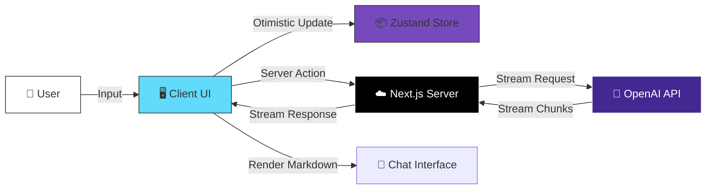
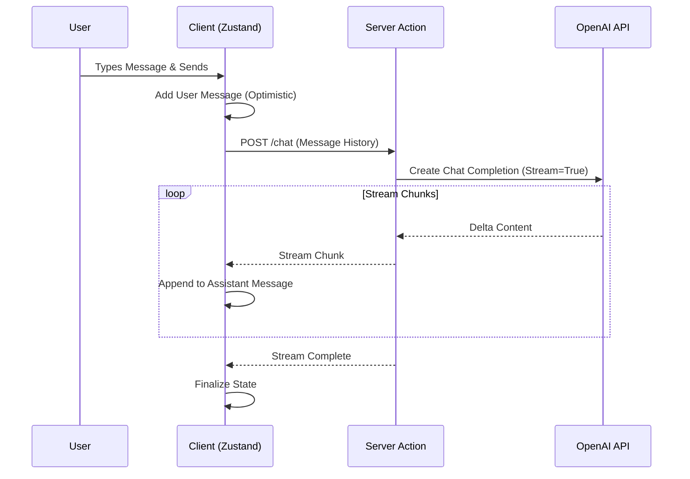

# Ai Buddy Chat

<div align="center">


<a href="https://nextjs.org">
  
</a>
<a href="https://react.dev">
  
</a>
<a href="https://www.typescriptlang.org">
  
</a>
<a href="https://tailwindcss.com">
  
</a>
<a href="https://openai.com">
  
</a>

</div>

---

# 🔮 Overview

**Ai Buddy Chat** isn't just another chatbot—it's a **premium, architectural masterpiece** designed for developers who demand excellence. Built on the bleeding edge of web technology, it orchestrates a symphony of **Real-time AI**, **Fluid Animations**, and **Type-Safe Architecture**.

Experience a chat interface that feels alive, responsive, and incredibly intuitive.

## ✨ Why Ai Buddy?

-   **⚡ Zero-Latency Feel**: Powered by optimistic UI updates and efficient streaming.
-   **🎨 Cinematic Visuals**: Deep integration of **Framer Motion** for layout transitions and **Lenis** for buttery smooth scrolling.
-   **🛠️ Developer First**: Built with strict **TypeScript**, modular **Next.js App Router** architecture, and **Radix UI** primitives.

---

# 🏛️ System Architecture

We adhere to a clean, separation-of-concerns architecture where the UI assumes a reactive state driven by Zustand, while the standard Next.js Server Actions handle the heavy lifting of API streaming.

## High-Level Data Flow



## detailed Interaction Sequence



---

# 🎨 Visual Effects Architecture

Our visual stack is layered to provide maximum performance with stunning aesthetics.

| Layer | Technology | Purpose |
| :--- | :--- | :--- |
| **Logic** | **React 19** | Core component lifecycle and state orchestration. |
| **Structure** | **Radix UI** | Unstyled, accessible primitives (Dialogs, Tooltips, Slots). |
| **Styling** | **Tailwind v4** | Atomic CSS with JIT engine for zero-runtime overhead. |
| **Motion** | **Framer Motion** | Physics-based animations for layout flows and presence. |
| **Scroll** | **Lenis** | WebGL-like smooth scrolling normalization. |

### 🌊 The "Flow" State
We utilize **Lenis** to hijack native scrolling, replacing it with a momentum-based interpolation that makes every scroll event feel weighty and premium. Combined with `framer-motion`'s `AnimatePresence`, chat bubbles don't just appear—they **flow** into existence, respecting the user's current scroll velocity.

---

# 📂 Project Structure

A meticulously organized codebase ensuring scalability and maintainability.

```bash
d:/Projects/Ai Buddy/
├── 📁 app/                    # 🚀 Next.js App Router System
│   ├── 📁 api/                #    Server-side API routes & Edge Functions
│   ├── 📁 chat-v2/            #    Experimental Chat Implementations
│   ├── layout.tsx             #    Root Layout (Providers Injection)
│   ├── page.tsx               #    Primary Application Entry
│   └── globals.css            #    Tailwind V4 Directives & Theme Variables
├── 📁 components/             # 🧩 UI Building Blocks
│   ├── 📁 ui/                 #    Shadcn/Radix atomic components
│   ├── chat-interface.tsx     #    Main Chat Orchestrator
│   └── message-bubble.tsx     #    Polymorphic Message Renderer
├── 📁 lib/                    # 🛠️ Utilities & Core Logic
│   ├── store.ts               #    Zustand Global State Management
│   ├── utils.ts               #    Style Mergers (clsx + tailwind-merge)
│   └── openai.ts              #    OpenAI Singleton Configuration
├── 📁 types/                  # 📐 TypeScript Definitions
│   └── chat.ts                #    Shared Interface Definitions
└── package.json               # 📦 Dependency Manifest
```

---

# ⚡ Getting Started

Transform your local environment into an AI powerhouse.

### 1️⃣ Clone & Install
```bash
git clone https://github.com/kirtan597/Ai-Buddy.git
cd Ai-Buddy
npm install
```

### 2️⃣ Configure Intelligence
Create a `.env.local` file to connect the brain.
```env
OPENAI_API_KEY=sk-your-super-secret-key
```

### 3️⃣ Ignite
```bash
npm run dev
```
Visit `http://localhost:3000` and witness the magic.

---

# 🤝 Contribution
Innovation happens together.
1.  **Fork** the repo.
2.  **Branch** off (`feature/quantum-leap`).
3.  **Commit** your brilliance.
4.  **Push** and open a PR.

---

<div align="center">

**Built with ❤️ by [Kirtan](https://github.com/kirtan597)**

</div>
