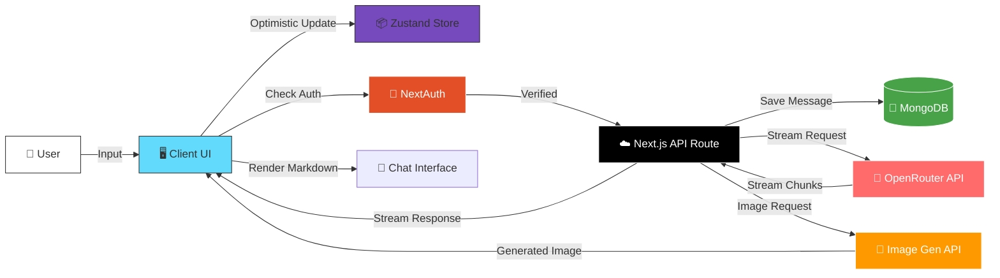
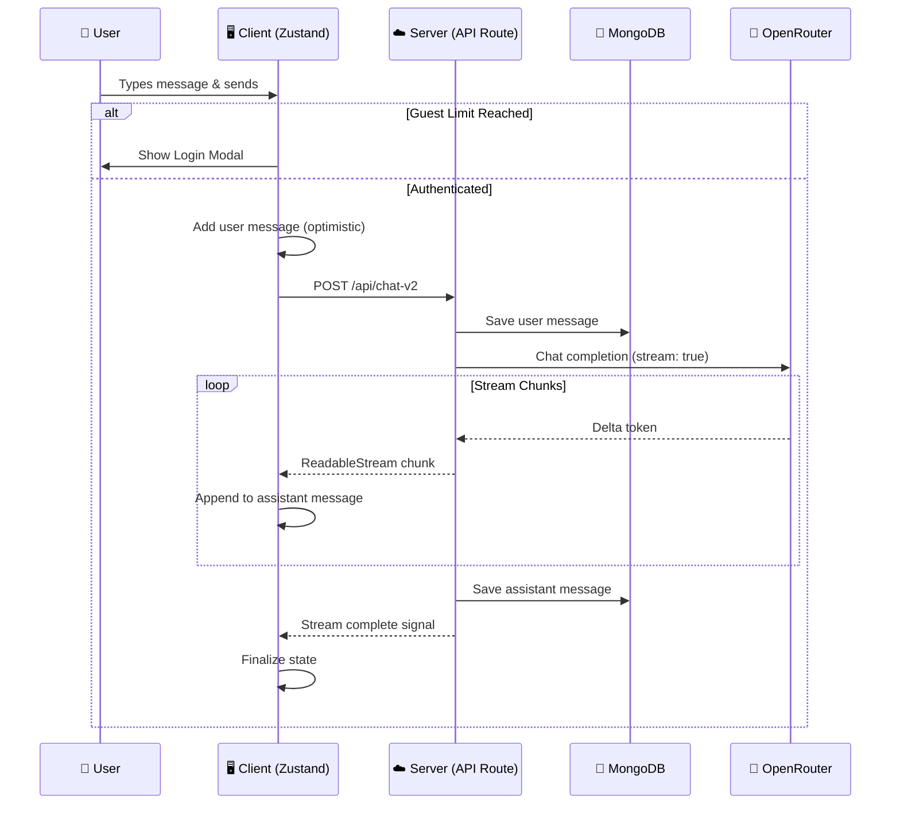

<div align="center">


<a href="https://nextjs.org"></a>
<a href="https://react.dev"></a>
<a href="https://www.typescriptlang.org"></a>
<a href="https://tailwindcss.com"></a>
<a href="https://www.mongodb.com"></a>
<a href="https://authjs.dev"></a>
<a href="https://openai.com"></a>
<a href="https://www.framer.com/motion"></a>

</div>

---

## 🔮 Overview

**Ai Buddy** is a **premium, full-stack AI chat application** built for a seamless, ChatGPT-like experience. Powered by cutting-edge web technologies, it delivers real-time AI streaming, full conversation history, Google OAuth authentication, image generation, and a beautifully responsive mobile-first design.

This isn't just another chatbot — it's a production-grade platform with a clean architecture, persistent cloud storage, and cinematic UI animations.

---

## ✨ Key Features

| Feature | Description |
|---|---|
| 🤖 **Real-time AI Streaming** | Token-by-token streaming responses via OpenRouter API |
| 🎨 **Image Generation** | AI-powered image generation directly inside chat |
| 🔐 **Google OAuth** | Secure sign-in with NextAuth.js & Google |
| 🆓 **Guest Mode** | Try the app without signing in (limited to 1 message preview) |
| 🧠 **Persistent History** | Conversations saved & synced in MongoDB across devices |
| 📱 **Mobile Responsive** | Fully adaptive layout with safe area insets for iPhone notches |
| 🌗 **Theme System** | Light/Dark/System theme support with smooth transitions |
| 📝 **Rich Markdown** | Full GFM markdown with syntax-highlighted code blocks |
| ✏️ **Conversation Management** | Rename, delete, and organize conversations via the sidebar |
| ⚡ **Optimistic UI** | Instant feedback before server confirmation via Zustand |
| 🎭 **Smooth Animations** | Framer Motion layout transitions + Lenis buttery-smooth scrolling |
| ⚙️ **Settings Modal** | Configurable AI model selection and preferences |

---

## 🏛️ System Architecture


```mermaid
graph LR
    User[👤 User] -->|Input| UI[🖥️ Client UI]
    UI -->|Optimistic Update| Store[📦 Zustand Store]
    UI -- Check Auth --> Auth[🔐 NextAuth]
    Auth -- Verified --> API[☁️ Next.js API Route]
    API -->|Save Message| DB[(🍃 MongoDB)]
    API -->|Stream Request| OR[🤖 OpenRouter API]
    OR -->|Stream Chunks| API
    API -->|Stream Response| UI
    UI -->|Render Markdown| Display[📄 Chat Interface]
    API -->|Image Request| IMG[🎨 Image Gen API]
    IMG -->|Generated Image| UI

    style User fill:#fff,stroke:#333
    style UI fill:#61DAFB,stroke:#333
    style Store fill:#764ABC,stroke:#333
    style API fill:#000000,stroke:#fff,color:#fff
    style OR fill:#FF6B6B,stroke:#fff,color:#fff
    style DB fill:#47A248,stroke:#fff,color:#fff
    style Auth fill:#E34F26,stroke:#fff,color:#fff
    style IMG fill:#FF9900,stroke:#fff,color:#fff
```

### Streaming Sequence


```mermaid
sequenceDiagram
    participant U as 👤 User
    participant C as 🖥️ Client (Zustand)
    participant S as ☁️ Server (API Route)
    participant D as 🍃 MongoDB
    participant AI as 🤖 OpenRouter

    U->>C: Types message & sends
    alt Guest Limit Reached
        C->>U: Show Login Modal
    else Authenticated
        C->>C: Add user message (optimistic)
        C->>S: POST /api/chat-v2
        S->>D: Save user message
        S->>AI: Chat completion (stream: true)
        loop Stream Chunks
            AI-->>S: Delta token
            S-->>C: ReadableStream chunk
            C->>C: Append to assistant message
        end
        S->>D: Save assistant message
        S-->>C: Stream complete signal
        C->>C: Finalize state
    end
```

---

## 📂 Project Structure

```
ai-buddy/
├── 📁 app/
│   ├── 📁 api/
│   │   ├── 📁 auth/                # NextAuth handler ([...nextauth])
│   │   ├── 📁 chat-v2/             # Streaming chat API route
│   │   ├── 📁 conversation/        # Create & update conversations
│   │   └── 📁 conversations/       # List all conversations
│   ├── globals.css                 # Tailwind v4 directives & CSS variables
│   ├── layout.tsx                  # Root layout with providers
│   └── page.tsx                    # Main app entry point
│
├── 📁 components/
│   ├── 📁 chat-v2/
│   │   ├── ChatInterface.tsx        # Main chat orchestrator
│   │   ├── ChatSidebar.tsx          # Conversation history sidebar
│   │   ├── InputBar.tsx             # Message input with file/image support
│   │   ├── MarkdownRenderer.tsx     # GFM markdown + syntax highlighting
│   │   ├── MessageBubble.tsx        # Individual message component
│   │   ├── MessageList.tsx          # Scrollable message feed
│   │   ├── ChatControls.tsx         # Top bar controls
│   │   ├── SessionMenu.tsx          # Per-session dropdown menu
│   │   ├── SettingsModal.tsx        # AI model & app settings
│   │   └── ThemeProvider.tsx        # Theme context provider
│   ├── LoginModal.tsx               # Google OAuth login entry
│   ├── UserProfileDropdown.tsx      # Compact user profile menu
│   └── SessionProviderWrapper.tsx   # NextAuth session wrapper
│
├── 📁 lib/
│   ├── 📁 chat-v2/
│   │   └── chatStore.ts             # Zustand global state store
│   ├── mongodb.ts                   # MongoDB connection singleton
│   ├── media-generation.ts          # Image generation utilities
│   └── utils.ts                     # Shared helper functions
│
├── 📁 models/                       # Mongoose schemas
│   ├── User.ts
│   ├── Conversation.ts
│   └── Message.ts
│
├── 📁 types/                        # Global TypeScript type definitions
├── 📁 hooks/                        # Custom React hooks
├── 📁 public/                       # Static assets
├── .env.example                     # Environment variable template
├── netlify.toml                     # Netlify deployment config (optional)
└── package.json
```

---

## ⚡ Getting Started

### Prerequisites

- **Node.js** >= 18.17.0
- **MongoDB** (local or [MongoDB Atlas](https://www.mongodb.com/cloud/atlas))
- **Google OAuth credentials** ([Google Cloud Console](https://console.cloud.google.com))
- **OpenRouter API key** ([openrouter.ai](https://openrouter.ai))

### 1️⃣ Clone & Install

```bash
git clone https://github.com/kirtan597/Ai-Buddy.git
cd Ai-Buddy
npm install
```

### 2️⃣ Configure Environment

Create a `.env.local` file in the project root:

```env
# ─── AI Provider (OpenRouter) ────────────────────────────
# https://openrouter.ai
OPENAI_API_KEY=sk-or-your-openrouter-key-for-chat
OPENROUTER_API_KEY_IMAGE=sk-or-your-openrouter-key-for-image

# ─── Database ───────────────────────────────────────────
# https://www.mongodb.com/cloud/atlas
MONGODB_URI=mongodb+srv://<user>:<password>@cluster.mongodb.net/ai-buddy

# ─── Authentication (Google Cloud Console) ──────────────
# https://console.cloud.google.com
GOOGLE_CLIENT_ID=your-google-client-id
GOOGLE_CLIENT_SECRET=your-google-client-secret
NEXTAUTH_SECRET=your-generated-random-secret
NEXTAUTH_URL=http://localhost:3000
```

> 💡 Generate `NEXTAUTH_SECRET` with: `openssl rand -base64 32`

### 3️⃣ Run the Dev Server

```bash
npm run dev
```

Visit **[http://localhost:3000](http://localhost:3000)** and start chatting!

---

## 📱 Mobile Support

Ai Buddy is fully optimized for mobile devices:

- ✅ Responsive layout for all screen sizes
- ✅ Safe area insets for iPhone notches & Dynamic Island
- ✅ Touch-friendly interactions and swipe gestures
- ✅ Proper keyboard handling on iOS & Android
- ✅ Compact sidebar that collapses on small screens

---

## 🛠️ Tech Stack

| Layer | Technology |
|---|---|
| **Framework** | Next.js 16 (App Router) |
| **Language** | TypeScript 5 |
| **Styling** | Tailwind CSS v4 |
| **State** | Zustand 5 |
| **Auth** | NextAuth.js v4 (Google OAuth) |
| **Database** | MongoDB + Mongoose |
| **AI** | OpenRouter API (multi-model) |
| **Animations** | Framer Motion 12 + Lenis |
| **UI Primitives** | Radix UI + shadcn/ui |
| **Markdown** | react-markdown + remark-gfm |
| **Syntax Highlight** | react-syntax-highlighter |

---

## 🤝 Contributing

Contributions are always welcome!

1. **Fork** the repository
2. **Create** a feature branch (`git checkout -b feature/amazing-feature`)
3. **Commit** your changes (`git commit -m 'feat: add amazing feature'`)
4. **Push** to the branch (`git push origin feature/amazing-feature`)
5. **Open** a Pull Request

---

<div align="center">


**Built with ❤️ by [Kirtan](https://github.com/kirtan597)**

⭐ Star this repo if you found it useful!

</div>
